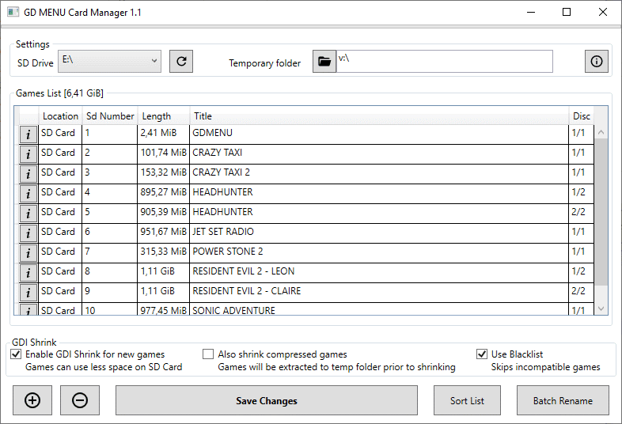
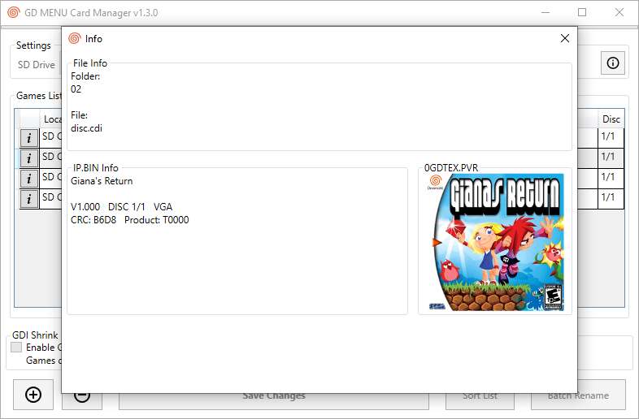

# GDMENU Card Manager
Manage content on SD Card for Dreamcast's GDEmu/GDMenu

For GDEMU to propperly work it's required to follow a pattern when putting files on the SD Card. 
If not done correctly it will take a lot of time to boot and can even fail to. 
This program will save the files the proper way so you console will boot super fast!

## Features
* Multi platform. Windows/Linux/OSX
* Supports GDI, CDI, MDS and CCD files. Also compressed files inside zip/rar/7z
* Add/delete/rename items
* Sort alphabetically
* Sort manually by drag and drop
* Automatically rename based on folder name, file name or internal name (IP.BIN)
* Show cover image (0GDTEX.PVR)
* If using a CodeBreaker image it can detect if it's the correct one.
* Saves name.txt on each folder to keep compatibility with other managers.
* Menu is built in GDI format. Compatible with consoles that cant boot MIL-CD.
* GDI Shrinking. Can reduce file size by removing dummy data without reducing the quality.

### GDI Shrinking
Can reduce the size of the game but some games won't work propperly.

The program have a blacklist with some games known to have problems after shrinking.

By default the blacklist will be used and those games will not be shrinked.

### Limitations
Linux version can't open rar and 7z files. Also it's not possible to use drag-and-drop.

**If you can't run it on OSX please check issue #4 for a workaround**

### Credits
This software is made possible by using third party toosl:

GDmenu by neuroacid 
[GdiTools](https://sourceforge.net/projects/dcisotools/), 
[GdiBuilder](https://github.com/Sappharad/GDIbuilder/), 
[Aaru](https://github.com/aaru-dps/Aaru/), 
[PuyoTools](https://github.com/nickworonekin/puyotools/), 
[7-zip](https://www.7-zip.org/), 
[SevenZipSharp](https://github.com/squid-box/SevenZipSharp/)

Special thanks to megavolt85 and everyone in the dreamcast scene
