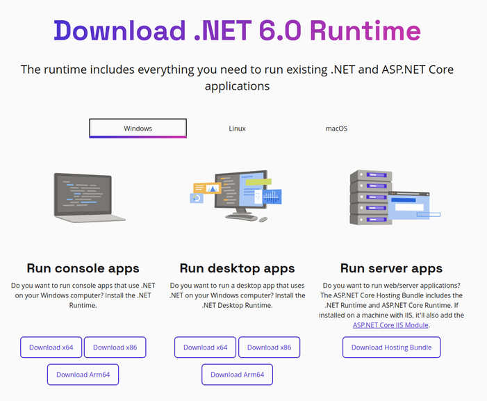

# GDMENU Card Manager
Manage content on SD Card for Dreamcast's GDEmu/GDMenu/openMenu

For GDEMU to properly work it's required to follow a pattern when putting files on the SD Card. 
If not done correctly it will take a lot of time to boot and can even fail to. 
This program will save the files the proper way so you console will boot super fast!

## Features
* Multi platform. Windows/Linux/OSX
* Supports both GDmenu and openMenu
* Supports GDI, CDI, MDS and CCD files. Also compressed files inside zip/rar/7z
* Add/delete/rename items
* Sort alphabetically
* Sort manually by drag and drop
* Automatically rename based on folder name, file name or internal name (IP.BIN)
* Show cover image (0GDTEX.PVR)
* If using a CodeBreaker image it can detect if it's the correct one.
* Saves name.txt on each folder to keep compatibility with other managers.
* Menu is built in GDI format. Compatible with consoles that cant boot MIL-CD.
* GDI Shrinking. Can reduce file size by removing dummy data without reducing the quality.

### GDI Shrinking
Can reduce the size of the game but some games won't work properly.

The program have a blacklist with some games known to have problems after shrinking.

By default the blacklist will be used and those games will not be shrunk.

### openMenu
openMenu will display customized icon, box art and text info for each title, but it requires additional files.

openMenu DAT files should go to this app's subfolder `tools\openMenu\menu_data`. 
Grab the DAT files from mrneo240's repos: [imagedb](https://github.com/mrneo240/openMenu_imagedb) and [metadb](https://github.com/mrneo240/openMenu_metadb)

### Windows version requires the .Net 6 Desktop Runtime
Download and install the [Desktop Runtime installer](https://dotnet.microsoft.com/download/dotnet/6.0/runtime) for your system.

### Limitations
On Linux version it's not possible to use drag-and-drop.

**If you can't run it on OSX please check issue #4 for a workaround**

### Building
- Linux x64 via CLI
  - ensure dotnet sdk 6.0 is installed via  [Install .NET on Linux](https://learn.microsoft.com/en-us/dotnet/core/install/linux)
  - clone repository
  - Build & Publish
    - Simple
      - execute `dotnet publish GDMENUCardManager.AvaloniaUI/GDMENUCardManager.AvaloniaUI.csproj -c Release`
    - Single File Self Contained (more portable, includes dotnet runtime bundled in)
      - execute `dotnet publish GDMENUCardManager.AvaloniaUI/GDMENUCardManager.AvaloniaUI.csproj -c Release --self-contained true -r linux-x64  -p:PublishSingleFile=true -p:IncludeNativeLibrariesForSelfExtract=true`
  - Execute `GDMENUCardManager` in `GDMENUCardManager/src/GDMENUCardManager.AvaloniaUI/bin/Release/net6.0/linux-x64/publish`
    -via double click or by running `./GDMENUCardManager` or by `dotnet ./GDMENUCardManager`

### Credits
This software is made possible by using third party tools:

GDmenu by neuroacid 
[openMenu](https://github.com/mrneo240/openmenu/),
[GdiTools](https://sourceforge.net/projects/dcisotools/),
[GdiBuilder](https://github.com/Sappharad/GDIbuilder/),
[Aaru](https://github.com/aaru-dps/Aaru/),
[PuyoTools](https://github.com/nickworonekin/puyotools/),
[7-zip](https://www.7-zip.org/),
[SevenZipSharp](https://github.com/squid-box/SevenZipSharp/)

Special thanks to megavolt85 and everyone in the dreamcast scene
